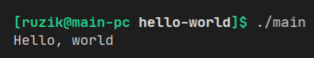

## Гарифуллин Руслан, БПИ191

Домашнее задание по курсу Архитектура вычислительных систем.

### hello-world

Просто и понятно, Hello World.

### counter

Считает сумму товаров в корзине (пока не будет введено число 0).