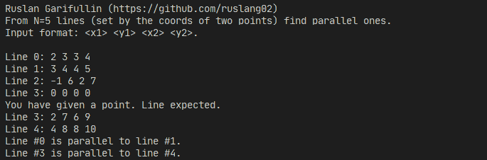

## Гарифуллин Руслан, БПИ191

Микро-проект 1 по курсу Архитектура вычислительных систем.

Разработать программу, которая решает вопрос о нахождении пар параллельных отрезков из общего числа N=5 отрезков, заданных координатами концевых точек.

Программа компилируема только на системах на базе ядра **Linux**!

Пояснительная записка доступна [здесь](./ExplanatoryNote.pdf).



### Компиляция и запуск

```bash
make
./main
```