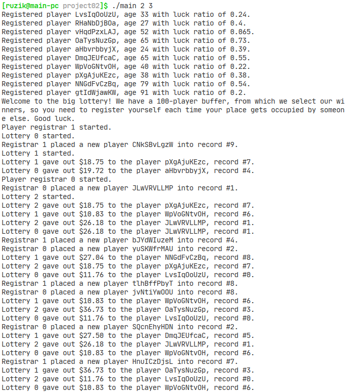

## Гарифуллин Руслан, БПИ191

Микро-проект 2 по курсу Архитектура вычислительных систем.

**Вариант 9**

*Задача о читателях и писателях-3 («подтвержденное чтение»)*

> Базу данных разделяют два типа процессов – читатели и писатели. Читатели выполняют транзакции, которые просматривают записи базы данных, транзакции писателей и просматривают и изменяют записи. Предполагается, что в начале БД находится в непротиворечивом состоянии (т.е. отношения между данными имеют смысл). Каждая отдельная транзакция переводит БД из одного непротиворечивого состояния в другое. Транзакции выполняются в режиме «подтвержденного чтения», то есть процесс-писатель не может получить доступ к БД в том случае, если ее занял другой процесс-писатель или процесс-читатель. К БД может обратиться одновременно сколько угодно процессов-читателей. Процесс читатель получает доступ к БД, даже если еезанял процесс-писатель. Создать многопоточное приложение с потоками-писателями и потоками-читателями. Реализовать решение, используя семафоры, и не используя блокировки чтения-записи.

Многопоточность реализована посредством библиотеки POSIX Threads.

Пояснительная записка доступна [здесь](./ExplanatoryNote.pdf).



### Компиляция и запуск

```bash
make
./main
```