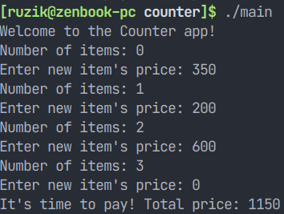
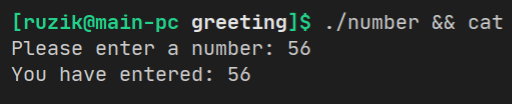
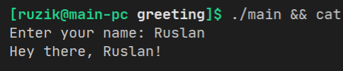
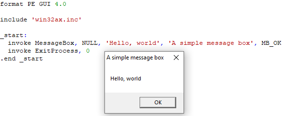

## Гарифуллин Руслан, БПИ191

Домашнее задание по курсу Архитектура вычислительных систем к семинару 2.

### hello-world

Просто и понятно, Hello World.

### counter

Считает сумму товаров в корзине (пока не будет введено число 0).

### greeting/number

Принимает на вход число и выводит его.
Взято с https://www.tutorialspoint.com/assembly_programming/assembly_system_calls.htm, однако потребовалось преобразование из NASM в FASM.
Использовалась для проверки работы `sys_read()`.

### greeting/main

Принимает на вход имя пользователя и приветствует его. Написаны функции для ввода/вывода при помощи системных вызовов.

### hello-world-win32

Программа, отображающая диалоговое окно с Hello, world! при помощи средств WinAPI.

