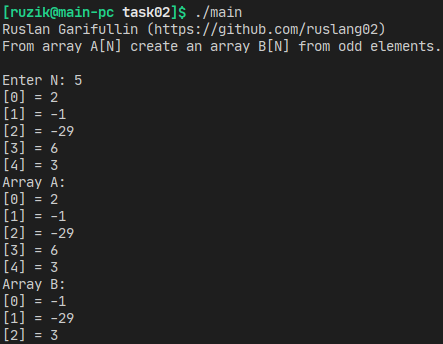

## Гарифуллин Руслан, БПИ191

**Вариант 9**

Домашнее задание по курсу Архитектура вычислительных систем к семинару 3-4.

На вход принимается длина массива А и сам массив А, состоящий из целых чисел.

**Задача:** создать массив B, состоящий из нечётных чисел.

