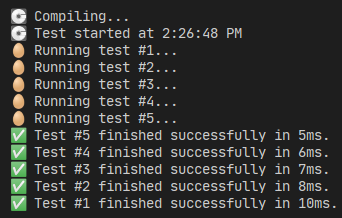

# Гарифуллин Руслан БПИ191

**Вариант 9**

**OpenMP-версия**

> Определить, является ли множество С объединением множеств A и B (A + B), пересечением множеств (A * B), разностью множеств А и B (A\\B), разностью множеств В и А (В\\А). Входные данные: множества целых положительных чисел A, B, C. Оптимальное количество потоков выбрать самостоятельно.

В программе предполагается, что множества отсортированы, а их элементы не повторяются.

Для реализации потоков использовалась библиотека OpenMP, большинство циклов паралелизированы, проверка условий также паралельно.

**Пример входных данных:**
```
5 5 3
1 2 3 4 5
3 4 5 6 7
3 4 5
```

**Пример выходных данных:**
```
C is an intersection of sets A and B
C is NOT a union of sets A and B
C is NOT a relative complement of A in B
C is NOT a relative complement of B in A
```

**Покрытие тестами**

Тесты хранятся в директории `test/`, где в папке `input/` хранятся входные данные, а выходные - в `output/`.

Для автоматического тестирования рекомендуется использовать скрипт для Node.JS `test.js`.

```bash
node test.js
```

